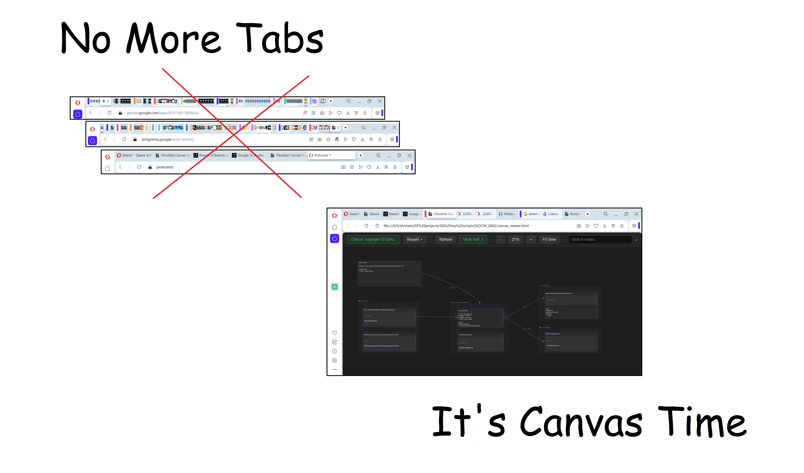
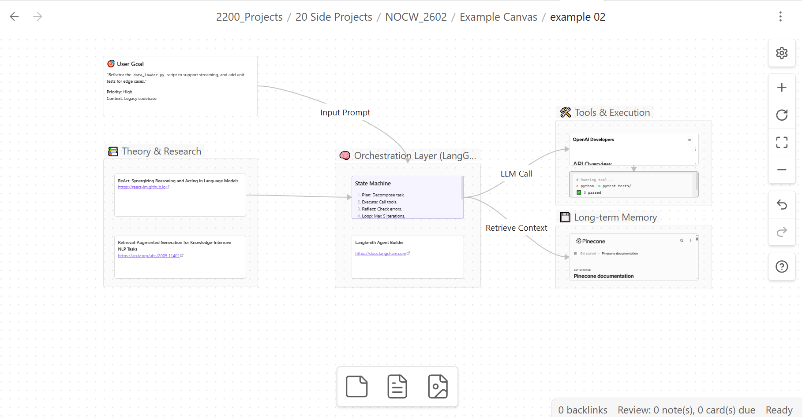
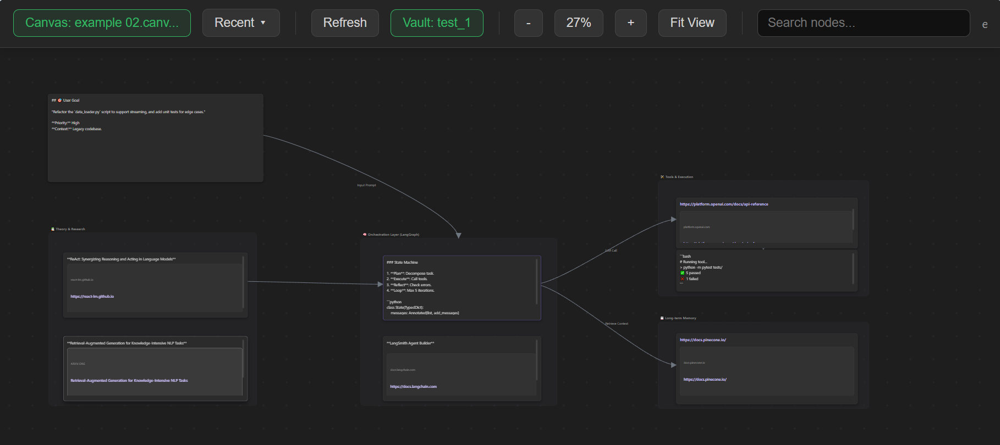

# 🕸️ Canvas Viewer: Web Links

A lightweight, **single-file** interactive viewer for Obsidian Canvas files (`.canvas`) that runs entirely in your browser. No server required.

> [!NOTE]
> **Status**: Currently a robust **Review/Viewer** tool.
> **Coming Soon**: Full Editing capabilities (nodes, connections, text) are in active development and will be delivered within ~2 weeks. 🚀

## 💡 The Vision: Your Browser as a Knowledge Studio
Imagine a workspace where you can organize thoughts, drop links, and make quick notes in a **Big Infinite Sheet**, all within your browser. Then, everything syncs seamlessly back to your local Obsidian vault. You revisit projects years later with **zero context loss**.

This project solves "Tab Fatigue" and "Project Amnesia".

---

## 🌟 Key Features

*   **Zero Install**: Everything is contained in one single `canvas_viewer.html` file.
*   **Vault Integration**: Connect your Obsidian Vault folder to see markdown notes directly in the canvas.
*   **Hybrid Link Previews** (New!):
    *   **Browsing Context**: Sites load directly inside the card (Mini-Browser).
    *   **Smart Fallback**: If a site blocks embedding (e.g., GitHub), the card shows a polished header with the site's Favicon and Title.
    *   **Rich Media**: Native support for YouTube embeds and Image links.
*   **Smart History**: Remembers your recent files and vaults for one-click reconnection.
*   **Search & Zoom**: Full pan/zoom controls and text search for large, complex maps.
*   **100% Local**: No cloud, no servers. Your data stays yours.

---

### 📸 Screenshots

| Obsidian Original | Canvas Web Viewer |
| :---: | :---: |
|  |  |
| *Your canvas in Obsidian* | *The same canvas in any browser* |

---

### 📦 How to Use

#### 1. Quick Start
1.  **Download** the latest `canvas_viewer.html`.
2.  **Open** it in any modern browser (Chrome, Edge, Firefox).
3.  **Drag & Drop** your `.canvas` file onto the window.

#### 2. Connect Your Vault (Recommended)
To see the full content of your Markdown notes:
1.  Click **"Select Vault Folder"**.
2.  Choose the root folder of your Obsidian vault.
3.  Browser permission will be requested (allow read access).

#### 3. Enable Hybrid Links
1.  Click the **Gear Icon** (Settings).
2.  Toggle **"Enable Link Previews"**.
3.  Enjoy browsing your reference links without leaving the board!

---

### 📅 Changelog

#### [2026-02-14] Hybrid Link Update 💘
*   **New**: **Hybrid Link Cards**. Links now attempt to load the live website inside the card.
*   **New**: **Smart Fallbacks**. If a site (e.g., GitHub) blocks being viewed in a frame, the card gracefully displays a polished header with the site's Favicon and Title.
*   **UID**: General UI polish for a cleaner, modern look.

---

### 📄 License

This project is licensed under the [MIT License](LICENSE).

